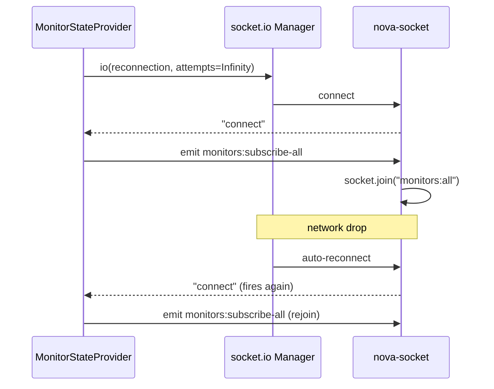

# Status Management Site Build

All work targets the source repo `D:\Dev\nova-status` (the open `nova-monitor` workspace only holds `.next` build artifacts).

## 1. Sidebar groups: collapsible + themed, better MonitorCard

Current sidebar is rendered inline in [layout.tsx](D:\Dev\nova-status\apps\nova-web\src\app(management)\m\layout.tsx) as bare `<h2>` + `
` blocks inside a `bg-accent` column, with no collapse behavior.

- Extract the group list into a new client component `app-sidebar.tsx` (in `apps/nova-web/src/app/(management)/m/`) so collapse state can use `useState`. The server `layout.tsx` keeps the tRPC fetch and passes serialized monitors/groups as props.
- Wrap each group with the existing Radix primitives from [collapsible.tsx](D:\Dev\nova-status\apps\nova-web\src\components\ui\collapsible.tsx) (`Collapsible` / `CollapsibleTrigger` / `CollapsibleContent`). Trigger row: chevron icon (rotates on open), group label, child count badge. Default open.
- Theme it with the existing-but-unused sidebar tokens already defined in [globals.css](D:\Dev\nova-status\apps\nova-web\src\styles\globals.css) (`bg-sidebar`, `text-sidebar-foreground`, `hover:bg-sidebar-accent`, `border-sidebar-border`) instead of raw `bg-accent`. Add a sidebar header containing the title and the "New monitor" trigger (task 2).
- Redesign `MonitorCard` in [status-components.tsx](D:\Dev\nova-status\apps\nova-web\src\app(management)\m\status-components.tsx): make the whole card a link to `/m/[id]`, add a colored status dot derived from `data.states[0].status` (up/down/pending/maintenance), show label + current response time, keep `UptimeBadge` + `StatusTimeline`, tighten spacing and add hover state. Keep it driven by `useMonitorState()`.

## 2. Schema-driven create-monitor modal

No create UI or mutation exists today. Build:

- Complete `.meta()` coverage in [monitorTypes.ts](D:\Dev\nova-status\packages\lib\src\monitorTypes.ts). Only `HTTP` fields have `.meta(monitorMeta({...}))`; add `label`/`description`/`required` meta to every field of GROUP, HTTP+keyword, TCP, PING, DNS, DOCKER, MYSQL, POSTGRESQL, MONGODB, REDIS. (This file is hand-written, not gen-script output, so editing is allowed.)
- A `MonitorForm` generator component that introspects `MONITOR_SCHEMA[type]`:
  - Read `(schema as z.ZodObject).shape`; for each field read `fieldSchema.meta()` for label/description/required and inspect its type to choose an input: string→`Input`, number→numeric `Input`, enum→`Select`/dropdown, boolean→`Checkbox`, `record`→key/value rows, `array<number>`→tags/comma input.
  - Render with the existing [field.tsx](D:\Dev\nova-status\apps\nova-web\src\components\ui\field.tsx) primitives (`Field`, `FieldLabel`, `FieldDescription`, `FieldError`) and surface validation errors per field.
- Validate with the schema itself: on submit run `MONITOR_SCHEMA[type].safeParse(values)`; map `error.issues` to per-field `FieldError`s. This reuses the exact schema the socket checker validates against in [checker.ts](D:\Dev\nova-status\apps\nova-socket\src\checker.ts).
- Modal shell: use the newly added [dialog.tsx](D:\Dev\nova-status\apps\nova-web\src\components\ui\dialog.tsx). Step 1 = pick type (grouped by `MONITOR_TYPES` MISC/STANDARD/DATABASE) + common fields (`label`, `interval`, optional `groupId`); Step 2 = the generated type-specific fields.
- Add a `create` mutation to [monitors.ts](D:\Dev\nova-status\apps\nova-web\src\server\api\routers\monitors.ts) router. Input: `{ label, type (enum MONITOR_TYPES_LIST), interval, groupId?, data }`, validating `data` via the per-type schema. Insert into the `monitors` table ([schema.ts](D:\Dev\nova-status\packages\db\src\schema.ts)). On success invalidate `monitor.get`.

## 3. Fix Socket.IO reconnect / room rejoin

Root cause in [monitor-state.tsx](D:\Dev\nova-status\apps\nova-web\src\provider\monitor-state.tsx): the rejoin listener uses `socket.on("reconnect", ...)`, but in socket.io-client v4 `reconnect` fires on the Manager (`socket.io`), not the Socket — so it never runs and the client stays out of `monitors:all` after any drop.

- Move the `monitors:subscribe-all` emit into a `connect` handler (fires on initial connect AND every reconnect), so the room is always rejoined. Remove the broken separate `reconnect` effect (or switch it to `socket.io.on("reconnect", ...)`).
- Register the `monitors:all` listener once; ensure the `connect`/`disconnect` listeners are cleaned up in the effect teardown (the current `reconnect` effect has no cleanup).
- In [web-socket.tsx](D:\Dev\nova-status\apps\nova-web\src\provider\web-socket.tsx): raise/remove the `reconnectionAttempts: 5` cap (use `Infinity`) so the client keeps retrying, and add `disconnect` / `connect_error` logging via the global `Print`.
- Server side ([connection.ts](D:\Dev\nova-status\apps\nova-socket\src\io\connection.ts)) already re-runs `socket.join("monitors:all")` per `monitors:subscribe-all`, so no server change is required for rejoin.

### Reconnect flow (after fix)

## Notes / constraints

- No type-gen scripts exist in the repo; `monitorTypes.ts` is hand-authored and safe to edit.
- Per your rules: I will not run dev-server / typecheck / gen commands and will rely on the LSP for type/lint feedback; package manager is bun.
- Create-modal uses the added `Dialog` component (`dialog.tsx`).

